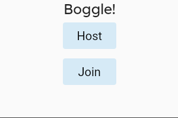
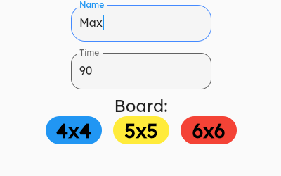
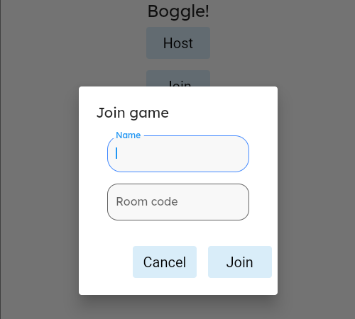
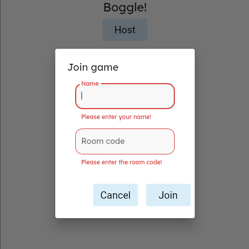
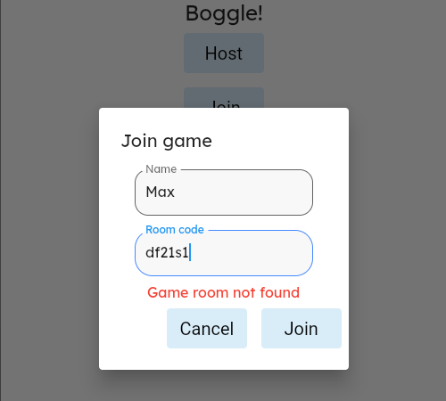
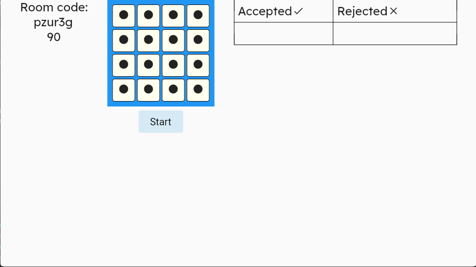
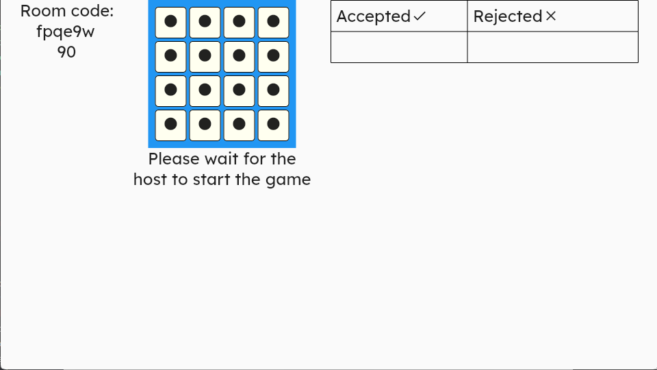
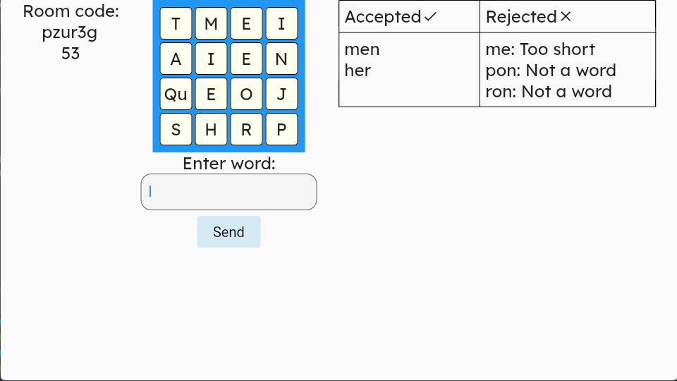
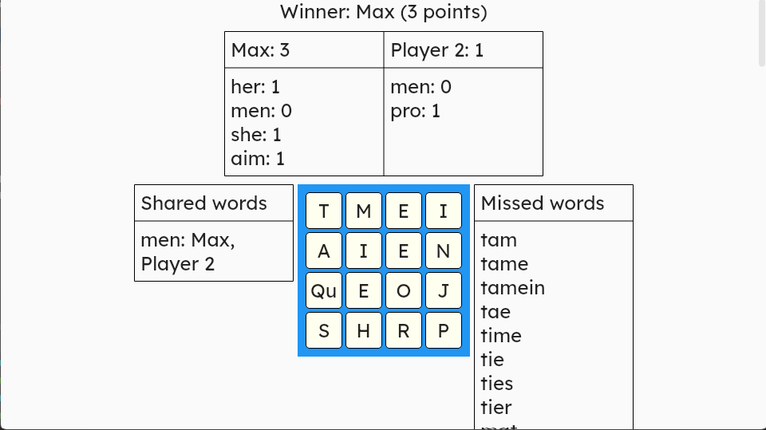
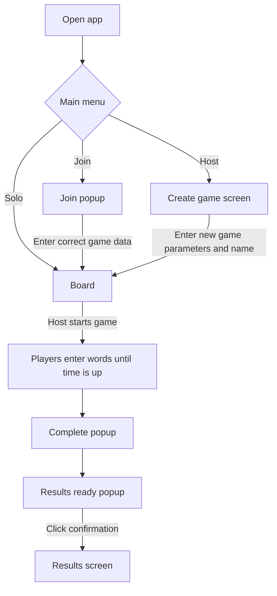

# Boggle Flutter

This is an online Boggle game that you can play with your friends. You can play at https://boggle-663ae.web.app/#/.

This is a general overview of the game and how to play. **To learn how it interacts with the server, check out the [boggle-server](https://github.com/TheOmnimax/boggle-server) repository.**

## About

This app was built using Flutter. It is meant to work as a web app.

## How to play

### New game

Here is how to start a new game:

1. Host clicks *Host* button.
1. Host enters name.
1. Host enters how long they would like the game to last in seconds.
1. Host clicks a game board button (e.g. *4x4*) to generate a game with a board of that size.
1. Host shares room code with other players
1. Other players click *Join*.
1. Other players enter their name and the room code, and click *Join*.
1. When everyone has joined the game, host clicks *Start*, and the game will start.

<table><tr><td>When joining a game fails, the cursor will automatically go to the text box that needs to be updated.</td></tr></table>

|  |  |  |
|:--:|:--:|:--:|
| Home screen | Game creation | Join game |

|  |  |
|:--:|:--:|
| Missing fields | Room not found |

|  |  |
|:--:|:--:|
| Host screen | Other players |

### Playing

When the game starts, a text box will appear. Enter a word, then either press *Enter* (or *Return*) on your keyboard, or click *Send*. In the upper-right, it will let you know if the word was accepted or not, and if it was rejected, it will tell you why (either it is too short, not on the board, or not a real word). If it is accepted, then it will tell you the potential score for the word.

Once time is up, everyone's scores will be calculated. If anyone has words in common, then those words will not be scored. Whoever has the highest score wins!

Plus, at the end, a list of all words that weren't entered by anyone will be shown.

|  |  |
|:--:|:--:|
| Playing | Results |

## User flow

## More documents

 * [Design document](/documents/design_doc.md)
 * [Design process](/documents/design_process.md)
 * [Developer guide](documents/developer_guide.md)
  