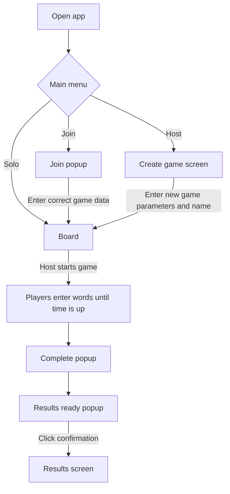

```mermaid
graph TD
  App[Open app] --> MainMenu{Main menu}
  MainMenu --> |Solo| Board[Board]
  MainMenu --> |Join| JoinPopup[Join popup]
  JoinPopup --> |Enter correct game data| Board
  MainMenu --> |Host| CreateGame[Create game screen]
  CreateGame --> |Enter new game parameters and name| Board
  Board --> |Host starts game| Play[Players enter words until time is up]
  Play --> CompletePopup[Complete popup]
  CompletePopup --> ResultsReady[Results ready popup]
  ResultsReady --> |Click confirmation| ResultsScreen[Results screen]
```